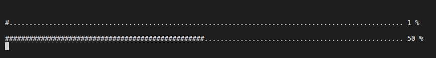
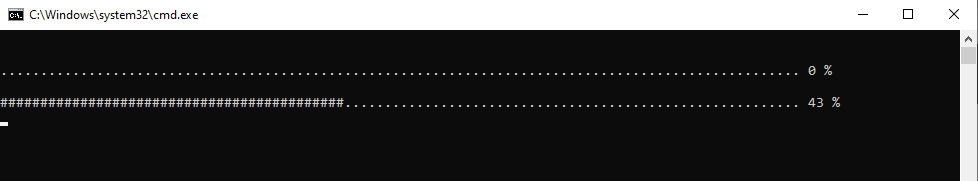
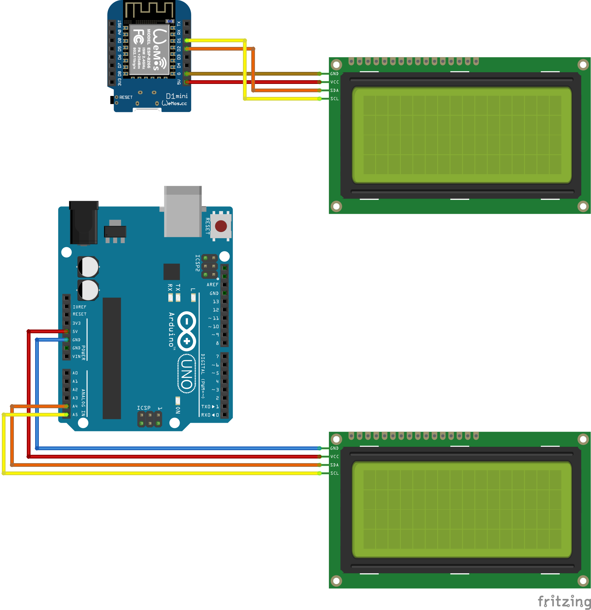

# cpu-info-monitor

## Monitor externo de recursos del CPU, utilizando Arduino y un display LCD 20x4

Instrucciones:
Primero necesitamos el script en python que se encarga de leer el estado de la CPU y RAM. Con esos datos armamos los textos para mostrar en el display, y los enviamos por el puerto COM correspondiente.

En la consola veremos algo como esto:

O si lo ejecutamos en DOS (se puede utilizar el .BAT en la misma carpeta) y se verá algo como esto:

Tip: se puede crear un acceso directo a este archivo para ejecutarlo.

Segundo necesitamos un arduino y el display, este recibirá por el Serial los textos que nos envía el programa en python y los publica en su display. Las conexiónes son muy simples si se utiliza un display con I2C integrado, tal como el del esquemático adjunto:

Inspiración.
Si bien hay varios proyectos similares a este que se encuentran con un rápido googleo, encontré que no compartían los códigos completos o directamente no se compartían.

